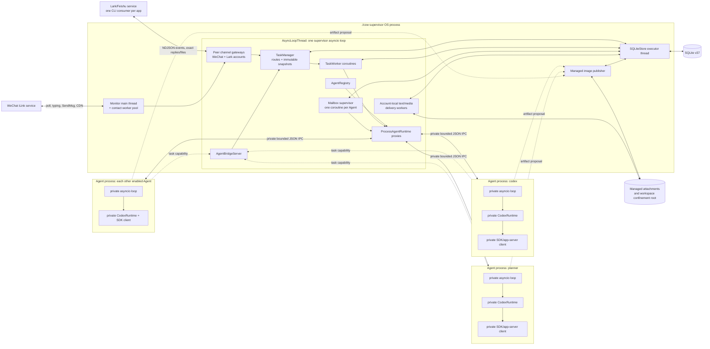
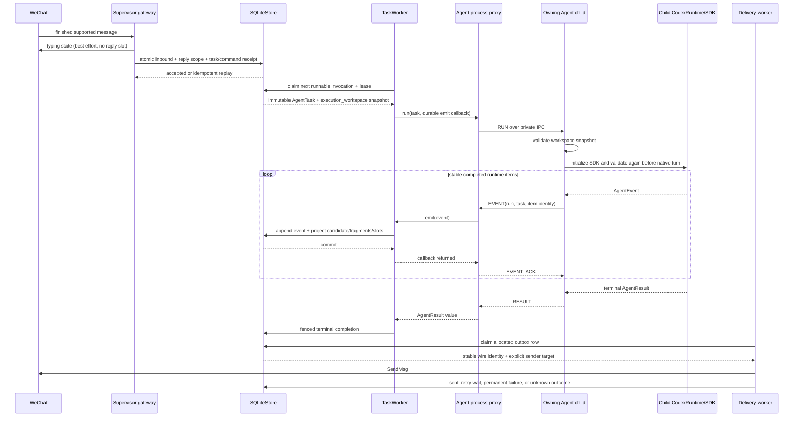

# Implemented Architecture

This document describes the code that `./cow` actually runs as of 2026-09-01.
It is a multi-channel, one-process-per-Agent system: the supervisor owns peer
WeChat and Lark/Feishu accounts, SQLite, routing, and delivery, while every
enabled Agent owns a persistent, independent OS child process containing its
own `CodexRuntime` and SDK client.
An Agent is not a supervisor coroutine or thread: it has a distinct PID,
interpreter, address space, event loop, runtime, and SDK client.

The latest SQLite schema is version 37. Versions 32-35 add reply presentation,
working-directory, aggregation, and Codex configuration-profile state. Version
36 adds canonical principals, bot-local conversation subjects, Lark bot
profiles/health, immutable identity provenance, and transport-neutral delivery
sidecars. Version 37 binds mapped direct accounts to a provider-history anchor
keyed by canonical principal, Agent, and session, while task provenance and
reply targets stay transport-local. Groups and threads remain bot-local.
Existing WeChat route, reply-scope, outbox and iLink wire identities are
retained unchanged.

## 1. Architecture at a glance

| Area | Active implementation |
| --- | --- |
| Public runtime | One `./cow` supervisor per database and atomically owned set of WeChat/Lark accounts |
| Agent execution | One persistent fresh-interpreter child process per enabled Agent |
| Agent state | One child-local asyncio loop, `CodexRuntime`, SDK client, thread cache, and execution slot per Agent |
| Cross-Agent concurrency | Different Agent children execute concurrently |
| Same-Agent concurrency | Task and mailbox work share one serialized Agent slot |
| Durability | Supervisor-owned SQLite v37 with claims, leases, identity provenance, account profiles, events, preferences, reply presentation/projection, and outboxes |
| Working directories | Per-session/Agent selection inside one configured confinement root; immutable per accepted task |
| Context management | Exact-model provider discovery plus native manual/automatic compaction inside each Agent child |
| Replies | Channel-policy projection: WeChat retains ten 3,000-character sends and `/recv`; Lark uses exact chat/thread delivery without that quota |
| Collaboration | Durable mailbox plus a supervisor-owned capability bridge |
| Failure isolation | One child can be interrupted, killed, restarted, or deleted without replacing peer children |
| Diagnostics | Owner-only rotating supervisor log with sanitized structured task lifecycle and typed provider failures |
| Process security | Lifecycle/failure isolation, not a hostile same-UID sandbox |

The production launcher contains no live `CodexRuntime`. It creates
`ProcessAgentRuntime` proxies and enables a fail-closed topology gate: startup
fails if an enabled Agent is in-process, shares a child PID, reports an invalid
generation, or does not become ready.

## 2. Active process topology



An Agent process is a dedicated leader process. The Codex SDK may create an
app-server or tool subprocess beneath that leader. Those descendants belong to
the Agent's process group during normal operation, but the architectural unit
exposed through `/agents` is the dedicated leader PID and generation.

## 3. Ownership boundaries

| Resource or responsibility | Supervisor | One Agent child |
| --- | --- | --- |
| Channel credentials/clients, polling or CLI consumers, typing, media, sends | owns per account | absent |
| SQLite connection, migrations, account-exact claims, leases, WeChat reply quota | owns | absent |
| Routes, Profiles, Modes, roles, model preferences, skill snapshots | resolves/persists | consumes immutable task snapshot |
| Working-directory preferences and execution snapshots | resolves, persists, captures | validates and consumes task-local snapshot |
| Task/mailbox scheduling | owns | executes only assigned work for its Agent |
| `CodexRuntime` and SDK client | no live production instance | owns exactly one |
| Provider thread bindings and active turns | no | owns privately |
| Provider credentials and context resolver/cache | absent | owns privately |
| Event persistence and user reply projection | owns | proposes events and waits for ACK |
| Generated-image publication | validates and persists | proposes task-correlated artifact |
| Agent collaboration policy/mailbox | validates and persists | calls bridge with task capability |
| Workspace confinement root | configures and validates | accesses the accepted directory according to task policy |

The children receive no store, database connection, channel client, sender, or
reply-policy allocator. The fresh interpreter and a strict import check keep
SQLite/store/channel/transport modules out of the child runtime graph.

### Channel and identity layers

Five identities are deliberately separate:

| Layer | Meaning | Authority / scope |
| --- | --- | --- |
| Transport account | One WeChat bot or one registered Lark app (`channel`, `bot_id`) | Local owner configuration and account lock |
| Authenticated actor | The sender ID authenticated by that transport; Lark requires tenant-stable `open_id` | Inbound adapter only; never message text or raw principal fields |
| Canonical principal | Optional mapping of an authenticated human sender across channel accounts | Authorization/audit, plus an explicitly bound direct-chat provider-history anchor; never bot ownership or a reply key |
| Conversation subject | Direct sender, bot-local group chat, or bot-local topic/root | Routes, modes, roles, models, cwd, and the transport alias for provider-thread continuity |
| Outbound reply target | Exact originating account plus user/chat and thread/root | Immutable task/outbox snapshot |

For a WeChat direct chat the actor, legacy subject scope, and reply recipient
remain the same value, so all established IDs are byte-for-byte compatible.
For Lark direct messages the subject scope is likewise the sender. For a group
or topic, the actor remains the sender `open_id`, while the subject is a framed
bot+chat or bot+chat+thread identity and the delivery address retains the exact
chat/thread. Mapping two direct accounts to one principal does not merge their
routes, reply scopes, or destinations. It does make them eligible to resolve
the same explicit `(principal, Agent, session)` provider-history anchor. A new
binding gets a collision-safe canonical anchor, while `./cow principal adopt`
can select one existing direct conversation as the anchor. Adoption never
copies or merges another provider thread: old task/thread rows remain immutable
and visible only under their exact originating account. Groups and topics stay
bot-local, and every result still replies through the task's initiating target.

Every enabled Lark profile has an owner-only CLI config directory and one
generation-fenced `lark-cli event consume im.message.receive_v1 --as bot`
process. Events with another app ID, an unstable sender identifier, a stale
generation, or a group message lacking a structured mention of that exact bot
are rejected before durable acceptance. Only the authenticated mention entity
key is removed; matching display-name text is left intact.

A connected Lark account also exposes an owner-only live onboarding boundary.
`/lark add [profile]` and the adapter-local exact Chinese trigger are accepted
only in a direct chat whose authenticated app-scoped sender currently resolves
to the enabled canonical `owner`. The service relays only a validated official
configuration URL, unchanged, plus a QR attachment. Credential staging is
globally serialized, while registration reuses the supervisor's already-open
SQLite store and incrementally acquires only the discovered `(lark, app_id)`
account lock. It never opens a competing store or releases startup account
locks. The prompt warns that the scanning account will receive canonical
`owner` authority and that the one-time link must not be forwarded.

Live registration is a fenced two-resource transaction: validate and publish
the isolated config and preflight its bot identity without starting ingress.
Using only that isolated Bot credential, it calls the official own-application
API and verifies the exact App ID, bot identity mode, enabled custom-app state,
and an app-scoped human creator distinct from the Bot Open ID. Feishu's owner
member object must corroborate the creator; international Lark may omit that
object according to its schema, but any returned object must agree. The target
owner is reverified after preflight, then a single `BEGIN IMMEDIATE` rechecks
the initiating account's exact active owner mapping and creates the
definitely-new profile, status, and revision-1 target owner mapping. It never
revision-remaps pre-existing target state. Only after that commit may ingress
start.

A failure before ingress is compensated by an exact conditional hard rollback
of the mapping/profile bundle; if the mapping changed or any ingress, outbox,
command, or other durable state appeared, the private credential and account
lock are retained instead of guessing. The onboarding service is drained
before dynamic account shutdown so credential rollback cannot race
account-lock release. Prompt and completion outboxes retain the initiating
bot/chat/thread target; no reply is redirected through the newly added app.

The durable outbox retains the shared Markdown source, but channel adapters own
its wire projection. Lark sends it through `--markdown` as a native rich-text
`post`; WeChat continues through its established plain-text Markdown sender.

## 4. Threads, loops, and processes

The supervisor uses several execution contexts, none of which substitutes for
an Agent child:

| Context | Purpose |
| --- | --- |
| Supervisor main thread | Blocking iLink long poll |
| Monitor contact pool | Concurrent contacts with per-contact ordering |
| `AsyncLoopThread` | Gateway, manager, registry, process proxies, task/mailbox and delivery coroutines |
| SQLite executor thread | Serializes one SQLite connection without blocking the loop |
| Bounded helper threads/processes | Blocking channel sends, media work, `/sh`, and child pipe writes |
| Agent child process | One Agent's runtime/SDK state and one execution slot |

Monitor threads enter the supervisor loop only through thread-safe coroutine
submission. Every process proxy is bound to that one supervisor loop. Each
child creates a separate loop with `asyncio.run`; no loop, lock, SDK client, or
SQLite handle is inherited from the supervisor.

## 5. Startup and topology proof

The public launcher is `cow`. `./cow` and `./cow run` synchronize dependencies
and execute `src/codex_wechat_bot.py`; the deprecated Python `--legacy` flag
reaches the same durable topology.

Startup proceeds in this order:

1. Resolve credentials, database, account, workspace, attachment, bridge, skill,
   and capacity configuration.
2. Acquire one exclusive database lock, then the sorted/deduplicated set of
   enabled `(channel, bot_id)` account locks atomically. Any conflict rolls the
   complete partial set back before SQLite opens.
3. Start the supervisor asyncio loop, open SQLite, apply consecutive migrations
   through v41, activate one database supervisor epoch, and reconcile durable state.
4. Still inside that owned store, idempotently map an enabled account to
   canonical principal `owner` only when it has no active mapping and exactly
   one distinct authenticated sender in durable inbound history. Zero or
   multiple senders are logged and skipped; Lark uses `open_id` and WeChat
   `from_user_id`.
5. Hydrate ready attachment metadata and create the parent-owned image publisher.
6. Construct one unstarted `ProcessAgentRuntime` for `codex`; no SDK runtime is
   constructed in the supervisor.
7. Register immutable Codex Profile versions, build `TaskManager` with
   `require_process_isolation=True`, and start the owner-only Agent bridge.
8. Manager startup restores durable dynamic-Agent registrations. Each named
   registration calls the template's `for_agent(id)`, producing an independent
   proxy with shared configuration and process-capacity accounting.
9. `AgentRegistry.start()` starts every enabled proxy. Each child must publish
   a positive PID, positive generation, and `ready` health.
10. The production gate verifies every PID is distinct from the supervisor and
   every other enabled Agent before task/mailbox workers start.
11. Start account-local delivery workers, then ingress: restore the WeChat
    cursor/poll and start one generation-fenced CLI consumer for each enabled
    Lark profile. One account restart does not reconstruct shared components.
12. While running, the live onboarding controller may add a Lark account by
    preflighting it, strictly registering it through this same store, and
    acquiring one incremental account lock. Existing account supervisors and
    the database ownership remain continuously held.

### Fresh child bootstrap

`multiprocessing` uses the `spawn` start method, never `fork`. Normal Python
spawn re-executes the supervisor's `__main__` module before unpickling its
target; doing that to `codex_wechat_bot.py` would import SQLite and WeChat in
every child. The proxy therefore serializes spawn preparation under a lock and
identifies the dependency-free top-level `process_agent` module as the child
main. The target then starts from that clean module graph.

Before importing `CodexRuntime`, the child installs a narrow synthetic
`src.runtime` package path so the adapter can load `media`, `roles`, `modes`,
and `policy` helpers without executing the heavyweight runtime initializer.
Startup asserts that SQLite/store/worker/channel/WeChat modules are absent.

## 6. Durable ingress and execution sequence



Commands remain in the supervisor and never enter this RUN path. `/sh` is a
bounded supervisor-owned subprocess, not Agent work, but it runs in the front
Agent's working-directory snapshot captured when the command was accepted.

### Working-directory selection and execution snapshots

`CODEX_WECHAT_WORKSPACE` is a canonical confinement root, not merely the
default cwd. Schema v33 stores a root-relative selection plus target
device/inode identity for each `(channel, bot, user, session, Agent)`. `/cd`
with no path reads that selection; `/cd <path>` changes only that scope.
Quoted paths support spaces, and relative paths resolve from the current
selection. The directory must already exist, be enterable, and resolve inside
the root; canonical and symlink escapes fail closed. The mutation and command
receipt complete atomically and persist across restart and switch-back.

Acceptance freezes `execution_workspace` with canonical root/path values and
root/target device and inode identities. Queued and running tasks retain it,
so later `/cd` changes only future work. The destination Agent child validates
the snapshot before SDK or network work and again before the native turn. A
missing, moved, replaced, or identity-changed root/target fails closed. The
runtime passes task-local cwd values and never calls process-global
`os.chdir()` or restarts an Agent for `/cd`.

If the selected target becomes stale, task and cwd-consuming command paths
fail closed. The supervisor can still persist cwd-independent controls without
a workspace snapshot, allowing an absolute in-root `/cd` to repair the scope.

For backward compatibility, a legacy durable task without an
`execution_workspace` continues in that Agent's configured default working
directory. The device/inode-pinned fail-closed guarantee therefore applies to
snapshotted and newly accepted work.

Validation is repeated immediately before an SDK/native turn and before the
supervisor launches `/sh`. Those pathname-based APIs do not provide an open
directory-descriptor (`dirfd`) contract, so a residual TOCTOU window remains
between final validation and path consumption.

Explicit `/ask` tasks resolve the destination Agent's selection for the
originating user/session, not the front/source Agent's selection. Agent-to-Agent
mailbox turns use the same destination-scoped rule. Dynamic Agent retirement
clears only that Agent's mutable directory preferences; immutable task/history
rows and their accepted snapshots remain.

## 7. Scheduling and real cross-Agent concurrency

The active SQLite rows use `dispatch_backend=compatibility`. That name now
means the retained durable claim/lease adapter; execution behind the claimed
row is process-isolated and never falls back to a supervisor `CodexRuntime`.

SQLite allocates a monotonically increasing `ready_sequence` for each Agent
incarnation. Task and mailbox claim paths share the same SQL guard:

- at most one `dispatching`, `running`, or `cancel_requested` invocation exists
  for an Agent incarnation;
- runnable task and mailbox work observe one per-Agent FIFO;
- delayed retries and not-yet-ready attachments do not block later runnable
  work; and
- different Agents are independently eligible.

The proxy and child each add a second one-slot guard. Thus task work and mailbox
work for one Agent cannot overlap even with a lightweight custom store, while
different proxies send to different child PIDs and execute simultaneously.

`CODEX_WECHAT_MAX_AGENT_PROCESSES` defaults to 32 and supplies both the shared
child-process capacity and production task-dispatch breadth. The old
`CODEX_WECHAT_WORKERS` value is ignored with a warning so a stale value of `1`
cannot globally serialize the process topology.

The concurrency tests use filesystem entry/release barriers in separate child
PIDs. Both Agents must enter before either release file exists, proving real
overlap rather than two queued supervisor coroutines.

### Durable cron scheduling

Schema v41 adds `natural_cron_drafts`, a durable confirmation state machine
for schedules interpreted by an Agent from ordinary WeChat or Lark messages.
The task-scoped local bridge derives the principal, account mapping revision,
originating bot/chat/thread, Agent incarnation, conversation, and immutable
task template from the authenticated running task; model-supplied routing or
identity values are never accepted. A proposal persists only a 15-minute
`pending` draft. A deterministic job ID is materialized only after a later
authenticated inbound message explicitly says `确认` / `confirm`. An applied
steering row created after the proposal is valid later-message evidence for an
input delivered into the still-running turn. Same-turn confirmation is
rejected. Confirmation inserts the deterministic job and marks the draft
confirmed in one SQLite transaction, so an insert failure rolls back fully and
a retry after a lost bridge response is idempotent. Cancellation, expiry, and a
newer same-scope draft close older proposals without enqueueing work or creating
an outbox message.
Cron, mailbox, child, and background tasks never receive this scheduling
capability.

Schema v40 stores each confirmed schedule in `cron_jobs` with its optional
canonical owner principal/account snapshot, exact originating channel/bot/actor and
chat/topic reply target, target Agent incarnation, schedule/timezone, next and
last firing times, optional expiry, and a frozen future-task template.
That template captures the conversation, mode, Profile/policy, model and
reasoning effort, role, and device/inode-pinned execution workspace at
creation time. Later route, `/mode`, `/model`, `/system`, or `/cd` changes do
not reinterpret an existing job.

After task workers are ready, the manager reconciles persisted schedules and
runs a bounded tick/wake loop. One `BEGIN IMMEDIATE` transaction selects the
earliest due job that has global, Agent, account, and Agent-account admission
capacity; a full per-account or per-Agent stream remains due without blocking
another eligible account. The transaction revalidates principal ownership,
the exact enabled Agent incarnation/Profile, and an originating Lark bot,
then inserts the queued task/invocation, an immutable `cron_firings` audit row,
and the next schedule projection without creating a raw-prompt outbox. On
completion, result/failure projection recognizes the authoritative firing-task
relationship and makes that result proactively deliverable through the
original bot and chat/topic without classifying it as an interactive
foreground reply. The unique `(job_id, scheduled_for)` firing identity plus
the transaction prevents double fire across scheduler races and restarts.
Schema v40 retains optional references to already-sent v39 reminder rows for
audit, suppresses undelivered prompt echoes, and repairs unseen v39 result
rows that had been incorrectly notification-disabled.

An overdue repeating job catches up once at most and advances directly to its
first future occurrence. A one-shot disables after firing; expiry, owner
mapping/principal revocation, originating Lark-bot removal, or target
Agent/Profile retirement disables future firing instead of rerouting it.
Listing and deletion validate the caller's exact active mapping revision in
the same transaction as the job access; a mapped principal may also manage
only legacy unmapped jobs from that exact transport account.

## 8. Agent lifecycle, routing, and history

A route is scoped by `(channel, bot_id, external_user_id, session_id)`. The
canonical conversation adds `agent_id`, and provider bindings additionally pin
mode, Profile version, policy version, and role version/hash.

### Create and switch

`/agent <id> [profile]` canonicalizes the ID, validates an optional Codex
config filename stem, restores or creates a dynamic Profile,
constructs a new process proxy, persists definitions, starts the child, and
proves its live unique PID before committing the new route. A failure leaves
the old route unchanged.

The immutable Profile stores only `codex_config_profile`, never TOML contents
or provider credentials. The child resolves the base configuration plus
`$CODEX_HOME/<profile>.config.toml`, passes the selected model/provider subset
over its private app-server stdio channel on both thread start and resume, and
merges the provider's bounded `/models` IDs with Codex `model/list`. Unknown
provider models receive no invented effort or modality capabilities. A
one-argument switch preserves an existing binding; an explicit conflicting
binding is rejected before process or route mutation.

Switching changes future ingress and never reads or sends provider transcripts,
task/event history, conversation history, mailbox contents, or thread caches.
Work that was already queued/running retains its original Agent and
conversation.

After the route commit, `/agent` may select destination-Agent candidates as
unseen messages. The selector is scoped to the exact channel, bot, user,
session, and destination Agent and requires `presentation='unseen'`, immutable
background classification (`foreground=0`), nonblank completed-item text, at
least one fragment, and every fragment still in `inbox_only`.

This is unread-item presentation, not history replay. The selector excludes
all pre-v32 candidates, foreground or already presented items, attachment-only
or fragmentless items, and anything with allocated, sent, failed/ambiguous,
mixed-state, or `deferred_quota` fragments. `/recv` remains the exclusive owner
of quota-deferred fragments. Attachment-only candidates remain unseen rather
than being rendered as empty text by `/agent`.

### Delete and recreate

`/delagent` is durable retirement. The store prevents new work and redirects
affected routes. The manager then stops and reaps the exact dynamic child while
its proxy is still registered. Only proven cleanup permits unregistering the
last handle. Immutable Profiles, tasks, events, reply rows, and conversations
remain. Only that Agent's mutable working-directory preferences are cleared;
accepted task snapshots remain immutable history.

The process-local registry may retain those historical Profile values, including
their pre-retirement `enabled` snapshot. Dynamic definition publication is
therefore scoped to the Agent being created or reactivated; creating one Agent
cannot republish an unrelated tombstoned Agent and conflict with SQLite's
disabled lifecycle state. Startup omits only detached tombstoned history and
still validates explicitly registered Profiles strictly.

Explicit recreation of the same string ID builds a fresh proxy and child PID.
Its process generation starts in the new process context; it never adopts the
old runtime/client/thread cache.

### Listing

`/agents` enriches process-backed descriptors with `pid`, `generation`,
`health`, and `process_isolated=true`. The rendered command marks the current
Agent and shows this process evidence. Compatibility embedders retain their old
descriptor shape, but the production topology gate rejects them.

## 9. Private IPC and child controls

The active process boundary is `src/runtime/process_agent.py`. It uses one
private duplex pipe per Agent and bounded canonical JSON envelopes containing:

```text
protocol version
message kind and ID
optional reply correlation ID
Agent ID and process generation
JSON payload
```

Supported flows include ready, run, event/ack, result, interrupt/ack, stop,
ping, model/skill discovery, skill resolution, session reset/compaction,
generated-image publication, and bridge-capability use.

Wire conversion accepts only JSON-safe scalars, finite numbers, string-keyed
mappings, bounded sequences, dates, paths, enums, and explicit domain
serializers. It validates nesting and a maximum encoded message size. Stale
generation, cross-Agent, mis-correlated, duplicate-conflicting, malformed, or
oversized traffic kills the generation rather than guessing.

The child receive loop remains active during a run, so priority interrupt and
stop controls reach the owning runtime. An early interrupt is latched even
before the backend registers its native turn. Interrupting one proxy cannot
touch a peer process.

Model and effort setters are intentionally not child controls. The supervisor
persists those preferences and places them in every future immutable task.
Model/skill listing and conversation reset do require child RPC because they
consult or mutate that Agent's private SDK/runtime state.

### Context discovery and compaction

`/compact` remains a supervisor command. Under the session control lock,
`TaskManager` resolves the captured/current Agent plus its exact conversation,
mode, Profile/policy versions, role, model, and workspace. It rejects active
work, a mismatched conversation, or a missing durable thread binding before
calling the selected process proxy. The correlated control reaches only that
Agent child, which invokes the native SDK compaction on the same provider
thread. The binding and durable task/event history remain unchanged.

Each child also owns a `ProviderModelContextResolver`. It reads the effective
Codex configuration and queries the configured provider's exact-model detail
and list endpoints. Valid provider context extensions are authoritative. If a
catalog omits them—as the OpenAI-compatible catalog contract permits—the
resolver uses `model_context_window` only when effective configuration selects
that exact model. It never derives or invents a limit from the model name.

When a window is resolved, thread start/resume receive native context and
automatic-compaction settings with a total-token threshold at 80% of the
window, capped by any lower valid advertised/configured threshold. The TTL
cache is isolated per child and keyed by provider/base URL/exact model and
fallback. Provider credentials are consumed only in that child; neither
credentials nor secret-bearing provider responses cross IPC or enter logs.

## 10. Parent-owned callbacks

### Event acknowledgement

The child sends each event and waits. The proxy validates run, task, Agent, and
generation identity, reconstructs `AgentEvent`, and awaits the supervisor emit
callback. In production that callback persists and projects the event. Only
then does the proxy return `EVENT_ACK`. A rejected callback returns an error to
the child and cannot be mistaken for a durable commit.

### Generated images

The child cannot own SQLite/attachment publication. It sends an artifact
proposal containing bounded output metadata. The proxy correlates task ID,
execution ID, and Agent ID to the original parent-side `AgentTask`, then calls
`ManagedImageOutputPublisher` with that exact object and its complete
`ReplyTarget`. Only the managed attachment ID returns to the child.

### Agent bridge

The supervisor issues an unguessable capability bound to task, execution, and
source Agent. The child prepends bridge discovery only when immutable policy
allows Agent messaging and the task is not an internal mailbox turn. The local
CLI reaches the owner-only Unix socket; the bridge revalidates the live task
and policy before listing peers or persisting a send.

## 11. Item-based WeChat replies

The stable reply boundary is a completed runtime Agent-message item containing
nonblank text. Deltas, reasoning, tools, status items, and aggregate terminal
content do not create duplicate replies. Identity uses the SDK item ID when
available and otherwise a deterministic ordinal within the task execution.

Each inbound user message creates one durable reply scope with at most ten
logical `SendMsg` identities. Text is split into fragments of at most 3,000
characters. Excess fragments are retained FIFO as `deferred_quota`; `/recv`
allocates the next batch under a later inbound scope. Allocated ordinals and
wire IDs are never recycled after failure or ambiguity.

Candidate projection snapshots rendered content, foreground/background class,
notification eligibility, sender Agent, and destination. Exact event replay
reuses that snapshot even if `/agent` or `/notify` later changes. Conflicting
reuse fails closed, preventing mutable route state from causing the former
`reply candidate identity conflicts: notify_enabled, foreground` error.

Schema v32 adds `reply_candidates.presentation`, `presented_at`, and durable
command-receipt `response_fragments_json`. Migration marks every pre-v32
candidate presented, because older databases have no sound way to distinguish
unread output from history. New eligible background candidates begin unseen.

Switch-back delivery uses this durable sequence:

```text
/agent route commit
  -> select exact-scope candidates with switch_only=True, present=False
  -> complete immutable command receipt with candidate IDs and fragments
  -> atomically project command outbox and mark those candidates presented
  -> SendMsg from the durable outbox
```

Selection does not mark a candidate. If command projection fails, the candidate
remains unseen and no partial command outbox survives. Crash/redelivery reuses
the receipt's original response, presentation IDs, item-local fragments, and
outbox instead of selecting again. The acknowledgement header and every unseen
text item keep separate logical fragment boundaries across replay.

The switch acknowledgement uses the `/agent` inbound message's ordinary
ten-slot scope and 3,000-character fragmentation. Its own overflow may become
`deferred_quota` for `/recv`; that newly deferred command output is distinct
from source candidates already containing `deferred_quota`, which are never
eligible for switch-back selection.

Every actual send uses the explicit stored destination user. `/ask` and
correlated Agent answers render completed items as `sender: message`, with the
canonical producing Agent as sender. Foreground ordinary replies retain their
item text while preserving sender identity in durable rows.

Typing is sent best-effort immediately after a supported message arrives. It
is not a `SendMsg`, consumes no quota slot, and does not affect durable
acceptance if it fails.

## 12. Profiles, roles, modes, models, and skills

Profiles and Modes are immutable `(id, version)` snapshots. Re-registering
canonical-identical metadata is idempotent; a real payload conflict fails
closed. Compatibility normalization prevents harmless legacy representation
differences from raising `mode version metadata conflicts` or
`profile version metadata conflicts` during route/process restoration.

All built-in modes allow network and command execution. `chat`, `plan`, and
`review` retain no-edit policy/instructions; `execute` additionally permits
workspace writes and requires an authorization snapshot. `/plan` is not a
command—`/mode plan` selects that mode.

`/system` stores a user/session/Agent-scoped role snapshot. A changed role
rotates the durable conversation binding; queued/running work remains pinned.
Role text changes instructions only and cannot grant permissions. Mailbox turns
never inherit a user role.

Model discovery runs in the selected Agent child and follows SDK pagination.
Model/effort preferences are durable future-task fields. Effort names are
capability-driven, so `ultra` appears and is accepted only for models that
advertise it.

Context-window discovery is separate because catalog context fields are
provider extensions. Exact-model validated metadata, or an exact effective
configuration fallback, drives native 80% automatic compaction. `/compact`
uses the current binding in the owning child and preserves its thread/history.

Skill discovery also runs in the selected child. The supervisor normalizes and
persists descriptors; task ingress pins the exact trusted bundle path/version/
hash and fails if those bytes later conflict.

## 13. Persistence and recovery

SQLite owns all correctness-critical state: inbound deduplication, command
receipts, Profiles/Modes, Agent lifecycle, routes, roles, session/Agent
working-directory preferences, tasks/executions and their immutable workspace
snapshots, events, mailbox invocations, thread bindings, attachments, reply
candidates/fragments/scopes/slots, delivery outboxes, natural-cron drafts, cron
jobs, and immutable cron firing audits. IPC wakeups and child memory are never
durable truth.

Task claims carry worker and claim-token leases. Event append, thread binding,
terminal completion, admission release, and mailbox transitions are conditional
on that ownership. Claim loss prevents a new external turn and suppresses a
late result.

If a child exits after RUN was sent, `ProcessAgentLostError` carries
`execution_uncertain=true`. `TaskWorker` maps it to `orphaned`, never `failed`,
because the SDK or a tool may already have caused an external effect. `/retry`
is the explicit recovery action.

An idle lost proxy restarts with a new PID and higher generation when started
again or when the next invocation reaches it. Peer proxies keep their original
PIDs/generations and continue running.

The repository also contains v26-v31 direct-child-dispatch tables and APIs,
authenticated IPC/lifetime foundations, and cgroup job probes. They are not the
active production scheduler. The active, tested cutover is the process proxy
behind the existing durable claim path.

## 14. Shutdown and cleanup ownership

Normal shutdown order is:

1. cancel and drain any live Lark onboarding transaction, retaining its exact
   account lock until credential publication is committed or rolled back;
2. stop every account ingress (WeChat Monitor and Lark consumers);
3. stop/drain every account-local delivery worker, then mailbox coroutines;
4. stop TaskManager workers and every Agent process while the bridge is live;
5. close the Agent bridge;
6. close SQLite and its executor;
7. close the supervisor event loop and all account clients/processes; and
8. release ownership locks.

Child stop asks the local runtime to interrupt active work, waits boundedly,
closes the SDK client, sends `stopped`, exits, and is reaped. Timeout escalates
through process-group `SIGTERM` and `SIGKILL`. A cleanup serialization lock
ensures only one coroutine joins/reaps a given process handle.

The proxy does not clear its child handle, process-group identity, registry
marker, or shared capacity reservation until leader exit, reaping, and current
process-group emptiness checks succeed. Cleanup failure remains retryable; the
manager retains supervisor ownership rather than pretending shutdown completed.

## 15. Security and remaining hardening boundary

The process architecture materially isolates runtime lifecycle and failure:

- one Agent cannot share or corrupt another Agent's in-memory thread/cache;
- one stuck client can be interrupted/killed/restarted independently;
- cross-Agent work runs in different PIDs; and
- WeChat/SQLite survive a single child crash.

It is not a hostile-code confidentiality boundary. Children normally share a
Unix UID and configured workspace root, and current modes allow network/commands.
Every selected cwd is canonically confined to that root, but same-UID processes
can still reach overlapping files. Every child has a generation-specific
supervisor-lifetime pipe watched outside its event loop; losing the supervisor
kills the child's process group. Linux additionally arms a parent-death signal.
Normal and lost-child cleanup also kills and proves empty the process group.
Arbitrary descendants that deliberately escape that group are not guaranteed
to die if the supervisor itself receives `SIGKILL`.

Non-escapable descendant cleanup requires a real delegated cgroup-v2,
container, namespace, or brokered-tool boundary. `job_containment.py` currently
provides identity/probe foundations only. This optional hardening gap does not
change the implemented one-dedicated-process-per-Agent topology and is not a
startup prerequisite.

## 16. Active configuration

| Variable | Default | Purpose |
| --- | --- | --- |
| `CODEX_WECHAT_DB` | user runtime DB | Supervisor SQLite path |
| `CODEX_WECHAT_WORKSPACE` | durable workspace | Canonical confinement root for every Agent and `/sh` working directory |
| `CODEX_WECHAT_ATTACHMENTS` | managed attachment directory | Binary media root |
| `CODEX_WECHAT_AGENT_SOCKET` | beside DB | Owner-only collaboration socket |
| `CODEX_WECHAT_SKILL_ROOTS` | empty | Trusted skill roots |
| `CODEX_WECHAT_TURN_TIMEOUT` | runtime default | Child Codex turn timeout |
| `CODEX_WECHAT_MAX_AGENT_PROCESSES` | `32` | Child capacity and dispatcher breadth |
| `CODEX_WECHAT_MAX_AGENT_QUEUE` | store default | Per-Agent unfinished work bound |
| `CODEX_WECHAT_MAX_GLOBAL_QUEUE` | store default | Global unfinished work bound |
| `CODEX_WECHAT_MAX_ACCOUNT_QUEUE` | global bound | Per-channel-account unfinished work bound |
| `CODEX_WECHAT_MAX_ACCOUNT_AGENT_QUEUE` | Agent bound | Per-channel-account/Agent unfinished work bound |
| `CODEX_WECHAT_MAILBOX_TTL` | store default | Mailbox expiry |
| `CODEX_LARK_CLI` | `lark-cli` | Version-pinned Lark CLI executable |
| `CODEX_LARK_ADMIN_PRINCIPALS` | empty | Comma-separated canonical principals allowed to mutate the global Agent registry from Lark |

`CODEX_WECHAT_WORKERS` is deprecated and ignored.

The owner manages app profiles with `./cow lark add [profile]`, `list`,
`status`, `reauthorize`, `disable`, `enable`, and `remove`. `./cow lark list`
is concise bot inventory. Every profile created through this local owner CLI is
implicitly managed by the local OS owner; bot management does not require or
create a human `open_id` principal mapping. Unfiltered `./cow lark principal
list` presents `OWNER-MANAGED LARK BOT PROFILES` followed by `HUMAN PRINCIPAL
MAPPINGS (OPTIONAL)`, making that separation visible. A principal-ID filter
selects only the human section. The legacy `./cow lark principal map|unmap`
surface manages those Lark-only human mappings; `./cow principal
list|map|unmap|adopt` manages exact human accounts across channels and selects
an existing direct-chat history anchor when required. Its list remains
human-only. Existing profiles without a human mapping are already
owner-managed and can optionally be attached with `./cow lark principal map
owner <profile> <ou_open_id>`.

Terminal `add` and `reauthorize` use the pinned QR-based `lark-cli config init
--new` flow in an isolated owner-only directory and relay its terminal
QR/verification URL. `add` also accepts an existing application through
`--app-id`, `--brand`, and an echo-disabled App Secret prompt. Either add flow
optionally accepts `--owner-open-id ou_...` to map one app-scoped human sender
identity to canonical principal `owner`; omission is the normal case without a
human mapping and never triggers an Open ID prompt. The mutually exclusive
`--without-owner` remains a compatibility no-op for that default. Those
terminal paths never infer a human account: an explicitly supplied ID must
belong to the human account under the exact app being added. By contrast, live
chat QR onboarding verifies a freshly created app's creator/owner with that
new app's Bot credential and always creates the owner mapping atomically. Open
IDs are app-scoped and differ across apps and organizations.

After the new bot identity is verified, private-config publication is an
atomic filesystem rename but remains a separately recoverable step from the
database commit. The durable profile, its status, and, when requested, the
mapping of `(channel=lark, bot_id=app ID, external_user_id=owner Open ID)` to
canonical principal `owner` commit in one SQLite transaction. Thus a requested
mapping cannot commit without its profile, but filesystem publication and the
SQLite transaction are not one cross-resource atomic operation. The recovery
sidecar retains an explicit human-mapping request across a recoverable failure.
Neither compatibility/identity option runs `lark-cli auth login` or creates
user OAuth state.
`./cow` forwards the captured App Secret through an anonymous stdin descriptor;
`--app-secret-stdin` retains the explicit non-interactive secret path and does
not require either human-mapping flag. In both cases the secret reaches
`lark-cli config init` only through bounded stdin, and child output is not
relayed. Imported
profiles retain durable credential provenance so removal deletes COW-local
state without deleting a potentially pre-existing OS-user-global keychain
entry. That App-ID-level provenance survives profile removal, vetoes later
automatic credential cleanup, and prevents imported profiles from entering QR
reauthorization. Bot registration and existing-app authentication are
application/bot identity, not user OAuth; neither path runs `lark-cli auth
login` or uses user impersonation.

## 17. Implementation map

| File | Responsibility |
| --- | --- |
| `cow` | Public launcher |
| `src/codex_wechat_bot.py` | Supervisor construction, topology gate, lifecycle order |
| `src/runtime/process_agent.py` | Active process proxy, clean spawn bootstrap, child loop, IPC, cleanup |
| `src/runtime/manager.py` | Routing, dynamic lifecycle, workspace resolution, immutable task snapshots, production isolation validation |
| `src/runtime/registry.py` | Runtime ownership and retryable start/stop bookkeeping |
| `src/runtime/worker.py` | Task/mailbox execution, event commit callbacks, uncertainty mapping |
| `src/runtime/dispatcher.py` | Durable claim wakeups and compatibility serialization |
| `src/runtime/sqlite_store.py` | SQLite v41 schema, identity/profile provenance, principal history anchors, transport sidecars, preferences, claims, cron drafts/scheduling/firing, reply projection and recovery |
| `src/channels/commands.py` | Shared command registry/help and channel capability filtering |
| `src/channels/wechat.py` | WeChat gateway, iLink projection, typing, `/recv`, ten-send/3,000-character policy |
| `src/channels/lark.py` | Lark CLI process, normalization/mentions, exact-account gateway, delivery and account restart isolation |
| `src/lark_cli.py` | Owner-only QR/existing-app onboarding and profile management |
| `src/lark_onboarding.py` | Isolated live QR staging, bot/owner identity fencing, publication and credential compensation |
| `src/lark_chat_onboarding.py` | Owner-direct-chat orchestration, exact-source replies, atomic profile/owner registration and live activation |
| `src/runtime/agent_bridge.py` | Task capability and local collaboration/natural-cron server |
| `src/runtime/media.py` | Managed attachments and parent-owned image publication |
| `src/agents/workspace.py` | Canonical workspace snapshots, confinement, and device/inode revalidation |
| `src/agents/model_context.py` | Child-local exact-provider/model context discovery and auto-compaction settings |
| `src/agents/config_profile.py` | Safe named Codex config loading and base-layer merge inside Agent children |
| `src/agents/codex_runtime.py` | Child-local Codex SDK adapter |
| `src/runtime/agent_process.py` | Disconnected authenticated-process foundation, not active executor |
| `src/runtime/agent_child_runtime.py` | Disconnected direct-dispatch foundation, not active executor |
| `src/runtime/job_containment.py` | Optional containment identity/probe foundation |

## 18. Executable architecture evidence

The process tests do not rely only on mocks. They prove:

- supervisor PID, Agent A PID, and Agent B PID are all different;
- two Agent children enter a filesystem barrier before either is released;
- one Agent serializes two runs;
- interrupts are scoped to the owning child;
- SIGKILL of one busy child yields an uncertain/orphanable error while its peer
  continues and the killed Agent restarts with a fresh PID/generation;
- TaskManager routes a dynamic Agent task to that Agent's child;
- `/delagent` reaps the exact PID and recreation gets a fresh process;
- the production launcher import graph still creates a clean child without
  importing SQLite/channel modules;
- generated-image relay uses the original supervisor task and ReplyTarget;
- event acknowledgements follow callback completion;
- `/compact` targets only the exact selected Agent binding, rejects active or
  unbound contexts, and executes in that Agent child;
- exact provider/model context resolution, 80% native thresholds, fallback,
  cache isolation, and secret redaction are covered without live provider calls;
- immediate interrupt races terminate instead of hanging;
- capacity transfers only after child cleanup;
- failed cleanup retains process/group/budget ownership; and
- `/cd` scope isolation and persistence, path quoting/relative resolution,
  root containment, symlink rejection, and atomic command receipt are tested;
- accepted workspace snapshots survive later `/cd`, `/sh` uses its captured
  front-Agent snapshot, and `/ask`/mailbox work selects the destination Agent's
  directory;
- Agent-side double validation rejects missing, moved, or replaced roots and
  targets without a process-global cwd change; and
- production rejects in-process runtimes and shared Agent PIDs.

The final release gate is the complete pytest suite, whitespace/diff checks,
and a safe `./cow --help` launcher smoke test.
